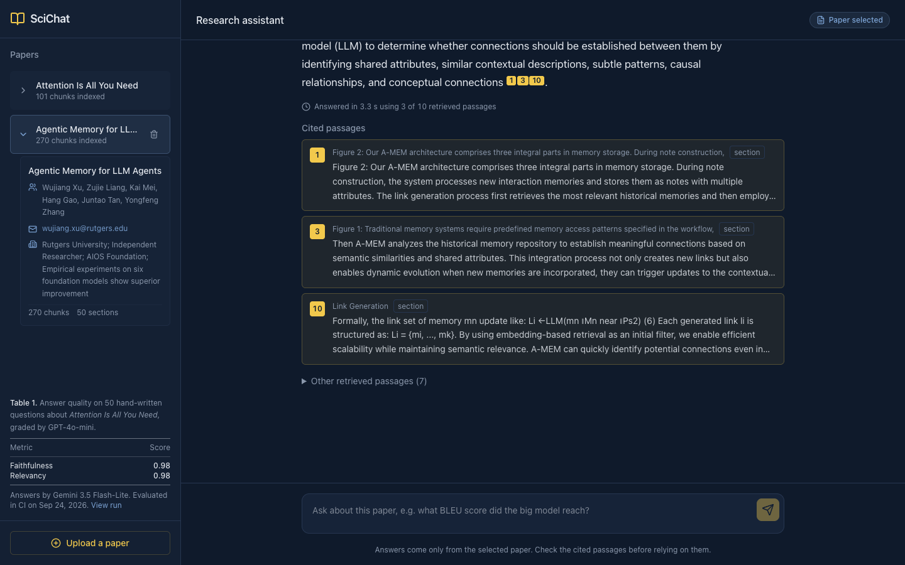
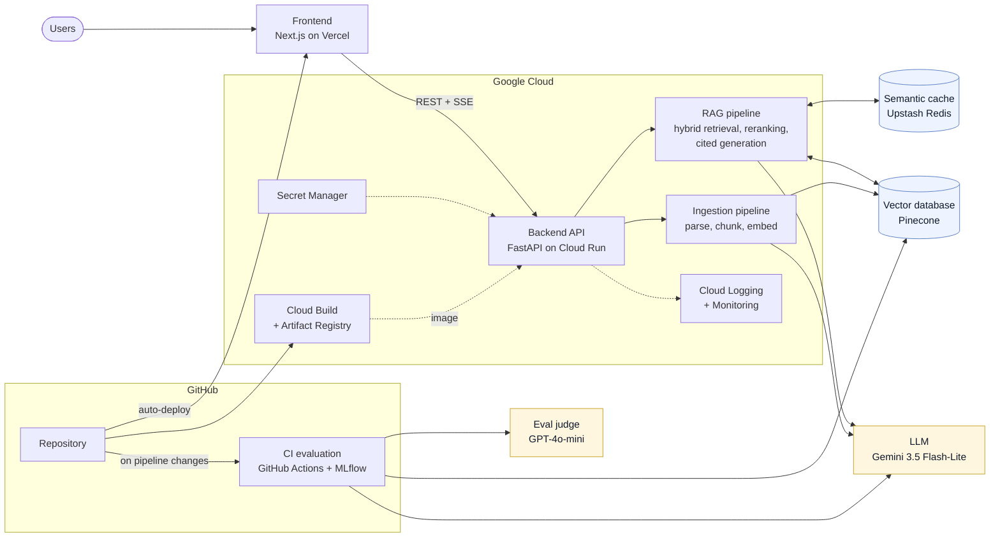

# SciChat

Ask questions about a scientific paper and get answers grounded in, and cited to, the paper's own text.

**Live demo:** [sci-chat-sigma.vercel.app](https://sci-chat-sigma.vercel.app). It comes pre-loaded with *Attention Is All You Need* and *A-MEM: Agentic Memory for LLM Agents*. The backend scales to zero when idle, so the first question after a quiet period can take a minute while it wakes up.



- **Cited answers:** every claim in an answer carries a numbered citation. Clicking a citation opens the passage it came from.
- **Refuses instead of guessing:** when the paper doesn't contain the answer, SciChat says so.
- **Hybrid retrieval with reranking:** vector search and BM25 keyword search, fused with Reciprocal Rank Fusion, then reranked by a cross-encoder.
- **Evaluated on every pipeline change:** a GitHub Actions workflow scores retrieval and answer quality and fails the build when quality drops below its thresholds.
- **Production details:** input guardrails, a per-paper semantic cache, demo-mode protections, per-request latency traces, and secrets kept in Secret Manager.

## Results at a glance

From the latest CI evaluation ([run 36351277309](https://github.com/Ackshay206/SciChat/actions/runs/36351277309), Sep 27, 2026) and the latency measurements described [below](#latency).

| Area | Metric | Result |
|---|---|---|
| Answer quality (50 hand-written questions) | Faithfulness, judged by GPT-4o-mini | **0.96** |
| | Relevancy, judged by GPT-4o-mini | **0.96** |
| Retrieval (96 frozen questions) | Hybrid + rerank, hit rate in top 10 | **0.573** |
| | Hybrid + rerank, MRR | 0.421 |
| Latency (Cloud Run, 4 vCPU, warm) | End-to-end, median of 10 questions | **4.07 s** (reranking 3.14 s of it) |
| | Answer served from the semantic cache | **0.10–0.14 s** |

## System design



**Key details:**
- **Chunk sizes by content type** (tokens, size / overlap): sections 256 / 80, page text 512 / 128, tables 1000 / 128, figures 500 / 120, references 700 / 120.
- **Chunk IDs come from chunk content,** so re-ingesting the same PDF overwrites its vectors instead of duplicating them.
- **Duplicate uploads are skipped:** an upload whose file hash is already indexed returns the existing paper without reprocessing it.
- **BM25 is rebuilt at startup from Pinecone,** because each vector's metadata stores its chunk text. Loaded papers get full hybrid retrieval with no separate document store.
- **Every query writes a trace:** one JSON line with per-step timings, and the answer is cached for 1 hour.

### Guardrails

| Layer | What it does |
|---|---|
| Input checks | Rejects empty questions, questions over 1,000 characters, and common prompt-injection phrases ("ignore previous instructions", "reveal your system prompt"…) before any retrieval or LLM call |
| Grounding prompt | Answers only from the numbered passages, cites every claim, replies *"I couldn't find this in the paper."* otherwise, and treats passage text as data, not instructions |
| Demo mode (`DEMO_MODE=true`) | Disables `/evaluate` and paper deletion on the public deployment |
| Upload limits | 10 MB maximum, one upload processed at a time (HTTP 429 otherwise), duplicates skipped |
| Quota errors | Gemini 429/402 responses show a clear "usage limit" message instead of a raw error |
| Cost caps | Cloud Run max 2 instances, a prepaid Gemini key with a hard stop at $0, a $5 GCP budget alert |

## Evaluation

Two datasets measure the two halves of RAG separately. If retrieval misses the right passage, generation can't recover, so each half is scored on its own.

**Retrieval:** [`data/eval/transformer_retriever_qa.json`](data/eval/transformer_retriever_qa.json)
- **The questions:** 96 questions, one generated from each chunk of *Attention Is All You Need*.
- **Frozen:** generated once and committed. Scores are only comparable across runs if the questions stay fixed.
- **Scoring:** each question counts as a hit if its source chunk is retrieved. Chunk IDs come from chunk content, so the frozen set survives re-parsing: 93 of 96 questions still match after a fresh parse. The 3 that don't point at figure descriptions, whose wording changes on every run.
- **Two stages measured:** raw retrieval (right chunk anywhere in the 30 candidates) and after reranking (right chunk in the 10 passages the LLM actually sees).

**Answer quality:** [`data/eval/transformer_gold_qa_50.txt`](data/eval/transformer_gold_qa_50.txt)
- **The questions:** 50 hand-written questions, 11 of them about the paper's tables.
- **The judge:** GPT-4o-mini scores **faithfulness** (is every claim supported by the retrieved passages?) and **relevancy** (does the answer address the question?).
- **Why a different model family:** the judge isn't the model that wrote the answers, which reduces self-preference bias.

### Latest retrieval results (96 frozen questions)

| Retriever | Raw hit rate (top 30) | Raw MRR | Hit rate after rerank (top 10) | MRR after rerank |
|---|---|---|---|---|
| Vector (Pinecone) | 0.685 | 0.344 | 0.607 | 0.433 |
| BM25 | 0.663 | 0.401 | 0.573 | 0.426 |
| **Hybrid (production)** | 0.697 | 0.365 | **0.573** | **0.421** |

**How to read these:**
- **Hit rates are conservative.** Most passages are indexed twice, once as a section chunk and once as part of a full-page chunk, and only the exact source chunk counts as a hit. Retrieving the other copy, which holds the same answer, is scored as a miss.
- **Precision is capped** at 1/k (one correct chunk per question), so it isn't reported.
- **The noise floor:** with 96 questions, hit rates are uncertain by about ±5 points, so single-digit differences between retrievers aren't meaningful.

### Quality gates (CI fails below these)

| Gate | Threshold | Latest |
|---|---|---|
| Hybrid + rerank hit rate | ≥ 0.50 (baseline 0.54–0.57) | 0.573 ✅ |
| Relevancy | ≥ 0.85 | 0.96 ✅ |

### How the metrics moved

| Change | Hybrid + rerank hit rate | Faithfulness / relevancy |
|---|---|---|
| Top-50 candidates ([run 36347089511](https://github.com/Ackshay206/SciChat/actions/runs/36347089511)) | 0.573 | 0.98 / 0.94 |
| **Top-30 candidates** ([run 36351277309](https://github.com/Ackshay206/SciChat/actions/runs/36351277309)) | **0.573** | **0.96 / 0.96** |

Cutting reranker candidates from 50 to 30 left reranked retrieval quality unchanged and cut reranking work by 40%. The ±0.02 changes in judge scores equal one question out of 50, within judge noise.

**Earlier baseline, not directly comparable:** before these changes (Feb 2026: Gemini 2.5 Flash, no citations, pdfplumber/PyMuPDF/tabula tables), the judge scored faithfulness 0.92 and relevancy 0.94. The later runs also changed the model, the prompt and the table extraction, so treat the improvement as directional.

### Choosing a table extractor

The five candidates were run on *Attention Is All You Need* in [`experiments/table-extraction-comparison.ipynb`](experiments/table-extraction-comparison.ipynb). The paper has 3 real tables, on pages 6, 8 and 9.

| Tool | Real tables found | Time | Notes |
|---|---|---|---|
| pdfplumber | 1 of 3 | 0.4 s | Relies on ruled lines; this paper's tables are mostly borderless |
| PyMuPDF | 1 of 3 | 0.8 s | Same limitation |
| tabula (lattice) | 1 of 3 | 1.1 s | Needs Java |
| tabula (stream) | 2 of 3 | 1.5 s | Found 3 tables, one of them spurious; missed Table 1 |
| PaddleOCR PP-StructureV3 | 3 of 3 | 155 s | Accurate, but a second deep-learning framework and too slow on CPU |
| **Docling (chosen)** | **3 of 3** | 38.5 s | Keeps captions ("Table 2: …") in each table's text; one false positive (the author block) |

Captions matter because 11 of the 50 gold questions refer to tables by number ("According to Table 2…").

## Latency

Every query writes a JSON trace line (`"event": "query_trace"`) to Cloud Logging with these per-step timings:
- paper switch
- cache lookup
- retrieval
- reranking
- generation
- total

The same trace goes to the browser, which shows it as "Answered in 4.1 s using 3 of 10 retrieved passages".

**Measured on Cloud Run** (4 vCPU, 10 frozen questions, cache cleared, warm instance, after the startup CPU boost window):

| Step | Median | Max |
|---|---|---|
| Cache lookup (embed + Redis) | 0.10 s | 0.13 s |
| Retrieval (embed + Pinecone + BM25 + fusion) | 0.16 s | 0.18 s |
| **Rerank (30 candidates, cross-encoder)** | **3.14 s** | 3.38 s |
| Generation (Gemini 3.5 Flash-Lite) | 0.62 s | 0.69 s |
| **Total** | **4.07 s** | 4.14 s |

Ten queries is enough for medians, not for P95/P99. A load-test harness that replays the frozen question set at 1, 4 and 8 concurrent requests is the next step.

### What slows it down

Profiling the same image on Cloud Run hardware found two causes:
- **The CPU is slow at matrix math.** 75% of rerank time is matrix multiplication. Cloud Run's AMD EPYC cores do about 90 GFLOPS each, against about 1,900 on an Apple M4, so a rerank that takes about 1 s on a laptop takes 3–4 s in the cloud.
- **PyTorch used the wrong thread count.** The container sees 6 host CPUs, so PyTorch ran 3 threads whatever the vCPU limit, and it ignored `OMP_NUM_THREADS`. [`configure_torch_threads()`](backend/app/services/llm_service.py) now sets it explicitly (`TORCH_NUM_THREADS=4` on Cloud Run), which made reranking about 15% faster.

## Deployment

| Piece | Where it runs | Notes |
|---|---|---|
| Frontend | Vercel (`sci-chat-sigma.vercel.app`) | Next.js static export; redeploys on every push to `main` |
| Backend | Google Cloud Run (`scichat-backend`, `us-east4`) | Image built by Cloud Build and stored in Artifact Registry; models baked into the image; 4 vCPU / 8 GiB; 0–2 instances; 900 s timeout |
| Secrets | Secret Manager | `google-api-key`, `pinecone-api-key`, `redis-url` |
| Vectors | Pinecone serverless | Index `scientific-papers` (demo) and `scientific-papers-ci` (CI) |
| Cache | Upstash Redis | Per-paper keys, 1-hour TTL |
| Evaluation | GitHub Actions | Runs on changes to `backend/app/core/**`, or manually |

**Cost:**
- **Cloud Run** stays inside the free tier at demo traffic: it scales to zero and bills only while a request is running.
- **Artifact Registry** storage is about $0.50/month for the 1.9 GB image.
- **Gemini** uses a prepaid key that stops at $0, so usage can't turn into an open-ended bill.

## Design decisions

- **Hybrid retrieval instead of vector-only.** BM25 catches exact terms (model names, table numbers, hyperparameters) that embeddings blur. Fusion weights favour vector search (0.9 / 0.1).
- **A cross-encoder reranker.** It raises MRR from 0.365 to 0.421 on hybrid retrieval, meaning the right passage ranks higher. It also costs about 75% of query latency on CPU, which is the main trade-off in the system.
- **Citations enforced in the prompt,** with numbered passages via LlamaIndex's `CitationQueryEngine`. Faithfulness can then be checked by a reader, not just by the judge.
- **A semantic cache scoped per paper.** Repeat questions cost no quota and return in about 0.1 s. Scoping keys by paper prevents one paper's answer being served for another.
- **Docling for tables** (see [Choosing a table extractor](#choosing-a-table-extractor)): the only fast option that found every table and kept its caption.
- **A frozen retrieval eval set and content-hash chunk IDs,** without which scores can't be compared between runs. Before freezing, the same code scored hybrid MRR anywhere from 0.34 to 0.49 depending only on which questions were generated.
- **The judge is a different model family from the generator** (GPT-4o-mini judging Gemini), to reduce self-preference bias.
- **Keys in Secret Manager, never in the image.** `.dockerignore` and `.gcloudignore` keep `.env` files out of both the image and the build upload.

## Scaling this design

At higher traffic the real-time path would change like this:
- **Ingestion becomes asynchronous:** Cloud Storage → Pub/Sub → Cloud Run Jobs, with status in Redis and the frontend polling it.
- **Paper metadata moves to a database** such as Firestore or Postgres.
- **The semantic cache gets a vector index** (Redis Stack or Pinecone) instead of a linear scan per paper.
- **Reranking moves to a GPU or a hosted reranker.**

A batch layer would be added next to it:
- scheduled evaluations on sampled real queries, to catch drift
- bulk re-indexing when the embedding model changes (e.g. Spark)
- query logs, latency and feedback in a data warehouse

## Running locally

**Requirements:** Python 3.11, Node 22+, and API keys for Gemini and Pinecone. OpenAI is only needed to run the evaluation.

```bash
# backend
cd backend
python3.11 -m venv venv && source venv/bin/activate
pip install -r requirements-dev.txt
cp .env.example .env                 # add your keys
uvicorn app.main:app --reload --port 8000

# frontend (in another terminal); in dev it calls http://localhost:8000/api/v1
cd frontend && npm ci && npm run dev  # http://localhost:3000

# evaluation (writes to the Pinecone index in PINECONE_INDEX_NAME; CI uses scientific-papers-ci)
cd backend && python -m scripts.run_evaluation
```

`docker compose up --build` runs the backend image with a local Redis on port 7860.

## Repository layout

```
backend/
  app/
    api/routes/      query (guardrails, cache, traces), ingest, documents, evaluate, health
    core/            document_parser, chunking, indexing (Pinecone), retrieval (hybrid + rerank + citations), evaluation
    services/        llm_service (Gemini, judge, embeddings, torch threads), cache_service (semantic cache)
  scripts/           run_evaluation (CI, MLflow), download_models (build-time model download)
  data/              documents_metadata.json (pre-loaded papers)
frontend/            Next.js app: chat with clickable citations, eval table, latency line
data/eval/           gold QA set and frozen retrieval QA set
experiments/         original notebook and the table-extraction comparison
.github/workflows/   evaluate.yml (quality gates)
Dockerfile           backend image (CPU-only PyTorch, models included)
```
